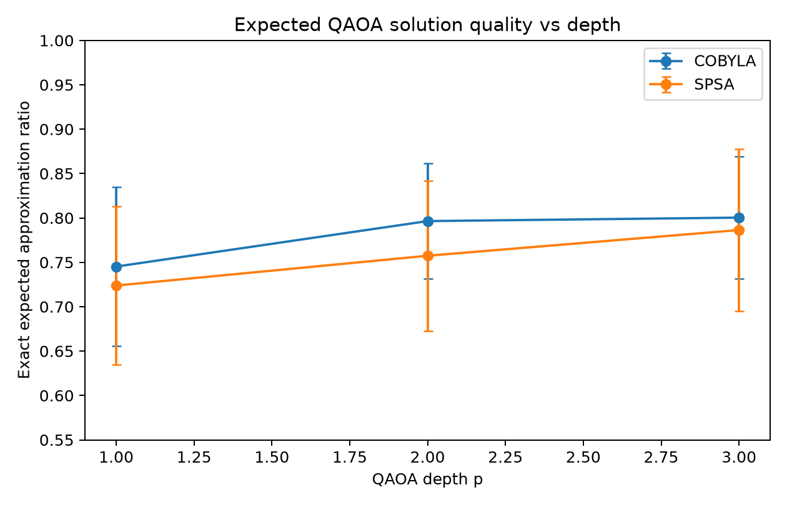
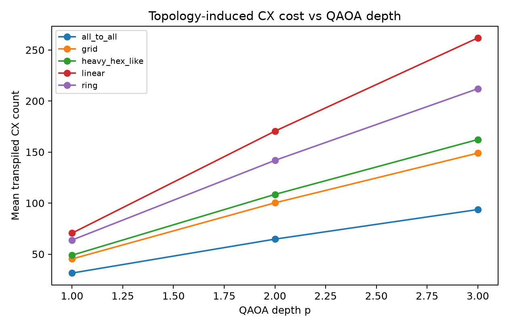
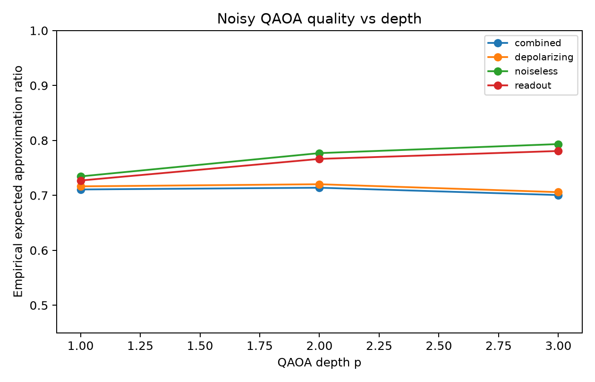
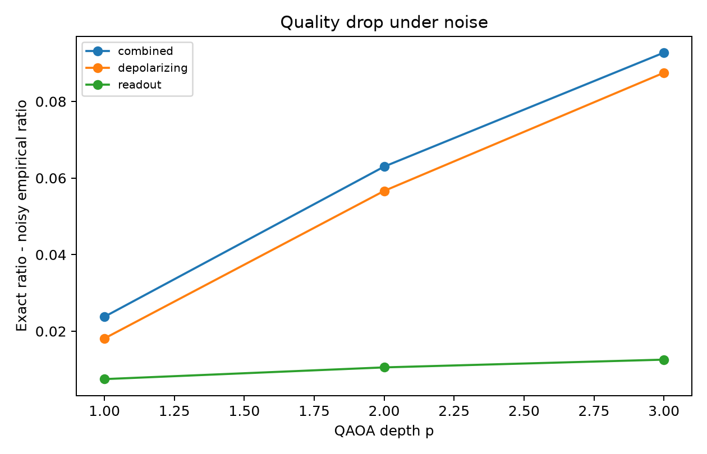

# Hardware-Aware QAOA Benchmarking for Max-Cut Optimization

## A Depth–Topology–Noise Trade-off Study

This repository contains a Qiskit-based empirical study of the **Quantum Approximate Optimization Algorithm (QAOA)** for **Max-Cut**, with a focus on whether increasing QAOA depth remains worthwhile after accounting for hardware-oriented execution constraints.

The goal is **not** to propose a new QAOA algorithm. Instead, this project provides a controlled, reproducible, hardware-aware benchmarking workflow that jointly evaluates:

- ideal/noiseless QAOA solution quality,
- transpiled two-qubit gate cost,
- hardware-connectivity-induced overhead,
- optimizer behavior,
- and degradation under noisy simulation.

The central question is:

> **When does increasing QAOA depth remain cost-effective under topology and noise constraints?**

---

## Motivation

QAOA is a hybrid quantum-classical algorithm for approximate combinatorial optimization. In the original QAOA formulation, increasing the depth parameter `p` can improve solution quality, but it also increases circuit depth and the number of gates required to implement the ansatz [1]. On near-term quantum devices, this creates a practical tension: deeper circuits may be more expressive in noiseless simulation, but they can become less useful after transpilation and under noisy execution.

For Max-Cut QAOA, the cost unitary is defined over the graph edges. As the number of QAOA layers increases, the number of two-qubit interactions grows, and once the circuit is mapped to a restricted hardware topology, additional routing overhead can further increase the transpiled CX count and circuit depth. Prior work on near-term QAOA resource scaling has shown that problem structure, ansatz depth, gate errors, and hardware connectivity can strongly affect practical resource requirements [2].

This project studies these effects directly under a controlled local-simulation setting.

---

## Research Questions

### RQ1 — Depth–Cost Trade-off

**Does increasing QAOA depth improve expected approximation quality enough to justify the additional two-qubit gate cost?**

This question compares QAOA depths `p = 1, 2, 3` using exact expected approximation ratio, optimal-solution probability, transpiled CX count, transpiled depth, and marginal quality gain per additional CX gate.

### RQ2 — Topology Sensitivity

**How does hardware connectivity affect the transpiled circuit cost and quality–cost ranking of QAOA configurations?**

This question evaluates the same QAOA circuits under different topology models:

- `all_to_all`,
- `grid`,
- `heavy_hex_like`,
- `linear`,
- `ring`.

The ideal approximation quality is unchanged across topology models; the topology analysis measures the **resource cost required to implement the same QAOA ansatz** after transpilation.

### RQ3 — Noise-Aware Depth Robustness

**Under noisy simulation, does deeper QAOA remain beneficial, or does noise reduce the advantage of higher-depth circuits?**

This question compares noiseless, depolarizing, readout, and combined noise settings under a fixed constrained topology. The goal is to test whether the best noiseless depth is still the best depth once gate noise and measurement noise are introduced.

---

## Scope

### Included

- Max-Cut problem instances.
- Small-to-medium graph sizes suitable for exact reference evaluation.
- QAOA depths `p = 1, 2, 3`.
- COBYLA and SPSA optimizers.
- Topology-aware transpilation.
- Noiseless and noisy local simulation.
- Reproducible YAML-based experiment configurations.
- Summary tables and publication-style figures.

### Not Included

This project does **not** claim:

- a new QAOA algorithm,
- quantum advantage,
- real-hardware validation,
- backend-calibrated noise modeling,
- DB-QITE or double-bracket algorithm implementation,
- or a new quantum compiler.

The topology and noise models are controlled proxies designed to study resource and robustness trends, not calibrated representations of a specific quantum processor.

---

## Experimental Design

### Problem Class

The benchmark uses Max-Cut instances generated from multiple graph families:

- Erdős–Rényi graphs,
- random regular graphs,
- Watts–Strogatz small-world graphs.

The CV-scale configuration uses:

- graph sizes: `n = 6, 8, 10, 12`,
- graph seeds: `7, 21, 42, 84, 168`,
- total graph instances: `3 × 4 × 5 = 60`.

### QAOA Configuration

The main experiment evaluates:

- QAOA depths: `p = 1, 2, 3`,
- optimizers: `COBYLA`, `SPSA`,
- exact expected approximation ratio from statevector evaluation,
- empirical noisy approximation ratio from sampled Aer simulation.

### Hardware-Aware Metrics

The repository reports:

- `mean_cx`: mean transpiled CX count,
- `mean_depth`: mean transpiled circuit depth,
- `mean_cx_per_edge_per_layer`: normalized CX cost,
- `mean_exact_expected_ratio`: exact noiseless expected approximation ratio,
- `mean_optimal_solution_probability`: exact probability of sampling an optimal Max-Cut solution,
- `mean_quality_drop`: exact ratio minus noisy empirical ratio.

The normalized CX metric is used because Max-Cut QAOA cost circuits scale with graph edges and QAOA layers. It provides a fairer proxy for comparing circuit resource cost across graph sizes and depths.

### Topology Models

The topology experiment uses Qiskit's transpilation flow with fixed basis gates and explicit coupling maps. The topology models are:

| Topology | Purpose |
|---|---|
| `all_to_all` | Ideal connectivity baseline |
| `grid` | 2D connectivity proxy |
| `heavy_hex_like` | Sparse heavy-hex-inspired proxy, not a calibrated IBM backend |
| `linear` | Highly constrained nearest-neighbor topology |
| `ring` | Slightly less constrained nearest-neighbor topology |

### Noise Models

The noisy simulation experiment uses:

| Noise setting | Description |
|---|---|
| `noiseless` | Baseline sampled simulation without injected noise |
| `depolarizing` | Gate noise model applied to one-qubit and two-qubit gates |
| `readout` | Symmetric measurement/readout error |
| `combined` | Depolarizing noise plus readout error |

Noise analysis is performed under a fixed constrained topology to isolate depth robustness under noise. It should be interpreted as a controlled simulation study, not as real-device performance prediction.

---

## Key Results

### 1. Increasing depth improves noiseless quality, but with diminishing returns

| QAOA depth `p` | Mean exact expected ratio | Std. ratio | Mean optimal-solution probability | Mean CX | Mean depth | Mean CX / edge / layer |
|---:|---:|---:|---:|---:|---:|---:|
| 1 | 0.7345 | 0.0896 | 0.0846 | 70.60 | 77.75 | 3.9712 |
| 2 | 0.7769 | 0.0777 | 0.1206 | 170.48 | 158.42 | 4.7492 |
| 3 | 0.7934 | 0.0810 | 0.1501 | 261.81 | 227.94 | 4.8934 |

The exact expected approximation ratio improves from **0.735** at `p=1` to **0.777** at `p=2` and **0.793** at `p=3`. However, the mean CX count increases from **70.6** to **170.5** and **261.8** gates.

This shows a clear quality–cost tension: the `p=2 → p=3` improvement is much smaller than the `p=1 → p=2` improvement, while still adding substantial two-qubit gate cost.



---

### 2. Hardware connectivity strongly changes transpiled CX cost

| Topology | p=1 mean CX | p=2 mean CX | p=3 mean CX |
|---|---:|---:|---:|
| `all_to_all` | 31.48 | 64.72 | 93.68 |
| `grid` | 45.31 | 100.28 | 148.98 |
| `heavy_hex_like` | 48.96 | 108.53 | 162.26 |
| `ring` | 62.65 | 142.43 | 212.28 |
| `linear` | 70.60 | 170.48 | 261.81 |

At `p=3`, the linear topology requires about **261.8 CX gates** on average, while the all-to-all topology requires about **93.7 CX gates**. This is nearly a **3× increase** in two-qubit gate cost for the same QAOA depth.

This result demonstrates that QAOA depth cannot be evaluated independently of hardware connectivity. A circuit that appears reasonable under ideal connectivity can become substantially more expensive after mapping to constrained topology.



---

### 3. Under gate noise, deeper QAOA no longer remains clearly better

The noiseless result suggests that `p=3` has the highest ideal expected approximation ratio. However, noisy simulation changes this conclusion.

Under depolarizing and combined noise, quality improves slightly from `p=1` to `p=2`, but then drops at `p=3`. This indicates that the additional depth and two-qubit gate exposure can offset the benefit of the more expressive ansatz.



The quality drop grows with depth under depolarizing and combined noise:

| Noise setting | p=1 mean quality drop | p=2 mean quality drop | p=3 mean quality drop |
|---|---:|---:|---:|
| `combined` | ~0.024 | ~0.063 | ~0.093 |
| `depolarizing` | ~0.018 | ~0.057 | ~0.088 |
| `readout` | ~0.008 | ~0.011 | ~0.012 |

The readout-only setting causes relatively small degradation, while depolarizing and combined noise cause degradation that increases sharply with QAOA depth.



---

### 4. Marginal quality gain per added CX decreases after p=2

| Transition | Optimizer | Mean quality gain | Mean CX increase |
|---|---|---:|---:|
| `p1_to_p2` | COBYLA | +0.0512 | +94.68 |
| `p2_to_p3` | COBYLA | +0.0039 | +77.65 |
| `p1_to_p2` | SPSA | +0.0336 | +105.08 |
| `p2_to_p3` | SPSA | +0.0290 | +105.00 |

For COBYLA, the `p=1 → p=2` transition provides a meaningful improvement in quality, while the `p=2 → p=3` transition provides only a small additional gain despite adding many CX gates. This is the clearest evidence of diminishing returns in the current benchmark.

---

## Main Findings

The experiment supports the following conclusions:

1. **Depth helps in noiseless simulation.** Increasing QAOA depth improves exact expected approximation quality and optimal-solution probability.

2. **Depth is not free.** The same increase in depth substantially increases transpiled CX count and circuit depth.

3. **The largest quality gain occurs from p=1 to p=2.** The move from `p=2` to `p=3` has smaller marginal benefit, especially under COBYLA.

4. **Topology matters strongly.** Restricted connectivity can multiply two-qubit gate cost. At `p=3`, the linear topology requires nearly three times the mean CX count of all-to-all connectivity.

5. **Noise changes the preferred depth.** Under depolarizing and combined noise, `p=3` no longer gives the best empirical approximation quality. In these settings, `p=2` appears more cost-effective.

6. **Hardware-aware depth selection is necessary.** Choosing QAOA depth based only on noiseless approximation quality can be misleading for near-term execution scenarios.

---

## Interpretation

A simple interpretation of the results is:

> **Higher QAOA depth improves ideal solution quality, but the improvement becomes less cost-effective as transpiled two-qubit gate cost and noise exposure increase.**

This makes the project relevant to hardware-aware quantum algorithm evaluation. It shows why a variational quantum circuit should not be assessed only by objective value in ideal simulation. Instead, QAOA performance should be evaluated jointly with circuit resources, topology constraints, and noise sensitivity.

For this benchmark, `p=2` often appears to be a more practical trade-off point than `p=3`: it captures most of the noiseless quality improvement while avoiding some of the additional CX cost and noise degradation associated with deeper circuits.

---

## Repository Structure

```text
qaoa-depth-topology-noise-study-clean-v2/
├── configs/
│   ├── quick.yaml
│   └── cv.yaml
├── scripts/
│   ├── run_experiment.py
│   ├── make_figures.py
│   └── run_all_quick.py
├── src/qaoa_dtn/
│   ├── analysis/
│   │   ├── plots.py
│   │   └── tables.py
│   ├── experiment/
│   │   └── runner.py
│   ├── qaoa_core/
│   │   ├── circuit.py
│   │   ├── evaluator.py
│   │   ├── graphs.py
│   │   ├── hardware.py
│   │   ├── maxcut.py
│   │   ├── noise.py
│   │   └── optimizers.py
│   └── utils/
│       ├── config.py
│       └── io.py
├── results/
│   └── cv/
├── figures/
│   └── cv/
├── requirements.txt
├── pyproject.toml
├── check_environment.py
└── README.md
```

---

## Installation

The project is designed for Python 3.10+ and has been structured as an editable local package.

```bash
conda create -n quantum python=3.11 -y
conda activate quantum

python -m pip install --upgrade pip
pip install -r requirements.txt
pip install -e .
```

Check that the environment is correctly configured:

```bash
python check_environment.py
```

Confirm that the package is imported from the current repository:

```bash
python -c "import qaoa_dtn; print(qaoa_dtn.__file__)"
```

The printed path should point to this repository, for example:

```text
.../qaoa-depth-topology-noise-study-clean-v2/src/qaoa_dtn/__init__.py
```

---

## Running the Experiments

### Quick run

Use this first to confirm that the environment works:

```bash
python scripts/run_experiment.py --config configs/quick.yaml
```

### CV-scale run

Run the full portfolio-scale experiment:

```bash
python scripts/run_experiment.py --config configs/cv.yaml
```

### Generate figures

If figures are not generated automatically, run:

```bash
python scripts/make_figures.py --results-dir results/cv --output-dir figures/cv
```

---

## Expected Outputs

The main results are saved under:

```text
results/cv/
├── summary_by_depth.csv
├── summary_by_topology_depth.csv
├── summary_by_noise_depth_optimizer.csv
├── summary_marginal_depth_cost.csv
└── results_manifest.json
```

The main figures are saved under:

```text
figures/cv/
├── exact_ratio_vs_depth.png
├── cx_count_vs_depth_by_topology.png
├── noisy_ratio_vs_depth.png
└── quality_drop_under_noise.png
```

---

## Reproducibility Notes

The experiment is configured through YAML files in `configs/`. The `cv.yaml` file specifies graph families, graph sizes, seeds, QAOA depths, optimizers, topology settings, noise settings, and output directories.

To avoid stale editable-install conflicts from older versions of this project, the package name is `qaoa_dtn`. This prevents accidental imports from previous repositories using the older `qaoa_tradeoff` module name.

---

## Limitations

This project should be interpreted carefully:

1. **Local simulation only.** The results are produced with local Qiskit/Aer simulation, not real quantum hardware.

2. **Topology proxies.** The topology models are simplified connectivity patterns. `heavy_hex_like` is a sparse heavy-hex-inspired proxy, not a calibrated IBM backend.

3. **Noise is synthetic.** The depolarizing and readout noise models are controlled simulation models. They do not represent calibration data from a specific device.

4. **Small graph sizes.** The graph sizes are intentionally small enough to support exact reference evaluation. The conclusions are about controlled depth–cost–noise trends, not large-scale Max-Cut performance.

5. **No new algorithm claim.** The contribution is empirical evaluation and resource-aware benchmarking, not a new optimizer or QAOA variant.

6. **Optimizer dependence.** COBYLA and SPSA can behave differently depending on initialization, budget, and graph instance. Results should be interpreted as benchmark evidence, not universal optimizer ranking.

---

## Future Work

Natural extensions include:

1. **Hardware-aware depth selection.** Define a utility score that balances expected approximation ratio against normalized CX cost and automatically selects the most cost-effective QAOA depth.

2. **Backend-specific transpilation.** Replace topology proxies with calibrated backend targets and device-specific constraints.

3. **Real-hardware validation.** Test whether simulator-based resource metrics predict performance trends on real quantum processors.

4. **Noise-level sweeps.** Vary depolarizing and readout error rates to estimate when deeper QAOA becomes ineffective.

5. **Topology-aware compilation strategies.** Explore edge ordering, initial layout selection, and routing strategies to reduce transpiled CX cost.

6. **Connection to surrogate-assisted search.** Use the results as a foundation for learning-guided or surrogate-assisted QAOA parameter search under limited evaluation budgets.

---

## CV-Ready Summary

**Hardware-Aware QAOA Benchmarking for Max-Cut Optimization**  
Developed a Qiskit-based hardware-aware benchmarking pipeline for Max-Cut QAOA, analyzing depth–cost trade-offs across graph families, optimizers, topology models, and noisy simulation settings.

**Key result:**  
Increasing QAOA depth improved noiseless expected approximation quality from **0.735** at `p=1` to **0.793** at `p=3`, but increased mean transpiled CX cost from **71** to **262** gates, revealing diminishing returns between solution quality and hardware execution cost.

**Hardware-aware insight:**  
Limited connectivity substantially increased QAOA circuit cost. At `p=3`, a linear topology required nearly **3×** the mean CX count of all-to-all connectivity, and under depolarizing/combined noise, `p=2` became more effective than `p=3` despite lower noiseless expressivity.

---

## References

[1] E. Farhi, J. Goldstone, and S. Gutmann, **A Quantum Approximate Optimization Algorithm**, arXiv:1411.4028, 2014.  
https://arxiv.org/abs/1411.4028

[2] P. C. Lotshaw, T. Nguyen, A. Santana, A. McCaskey, R. Herrman, J. Ostrowski, G. Siopsis, and T. S. Humble, **Scaling Quantum Approximate Optimization on Near-term Hardware**, Scientific Reports, 2022.  
https://www.nature.com/articles/s41598-022-14767-w

[3] M. Alam, A. Ash-Saki, and S. Ghosh, **Analysis of Quantum Approximate Optimization Algorithm under Realistic Noise in Superconducting Qubits**, arXiv:1907.09631, 2019.  
https://arxiv.org/abs/1907.09631

[4] S. Marshall, R. Kueng, and D. Gross, **Effects of Quantum Noise on Quantum Approximate Optimization Algorithm**, arXiv:1909.02196, 2019.  
https://arxiv.org/abs/1909.02196

[5] IBM Quantum Documentation, **Qiskit Transpiler and CouplingMap documentation**.  
https://quantum.cloud.ibm.com/docs/api/qiskit/transpiler  
https://quantum.cloud.ibm.com/docs/api/qiskit/qiskit.transpiler.CouplingMap

[6] Qiskit Aer Documentation, **Noise Models and ReadoutError**.  
https://qiskit.github.io/qiskit-aer/

---

## License

This repository is intended as a research portfolio project. Add a license file before public release if the repository will be shared openly.
